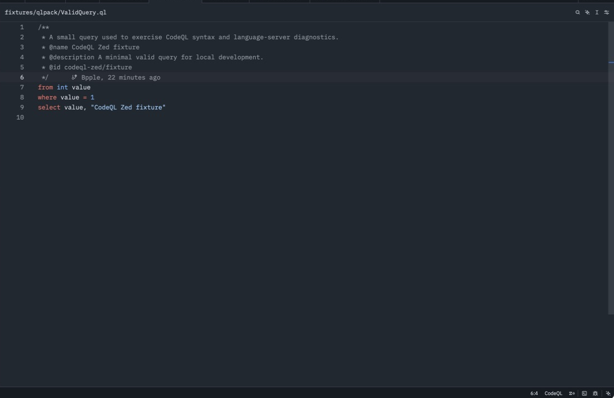

# CodeQL for Zed

[](https://github.com/Fruit-Guardians/codeql-zed/actions/workflows/ci.yml)
[](https://zed.dev/docs/extensions)
[](LICENSE)

CodeQL language support for [Zed](https://zed.dev/). The extension combines
Tree-sitter QL syntax support with the CodeQL CLI's native language server.



> Status: the repository contains the v0.1.0 baseline plus the v0.1.1, v0.2,
> and v0.3 prototype work. The official `zed-industries/extensions` PR is
> intentionally not submitted yet. `plan.md` and the private `docs/` folder
> are local-only and are not tracked by this repository.

## What is included

- `.ql` and `.qll` language detection;
- syntax highlighting, brackets, indentation, outline symbols, and Vim-mode
  text objects;
- CodeQL CLI language-server diagnostics and editor features;
- PATH discovery, explicit binary paths, complete argument overrides, and
  environment overrides;
- `runnables.scm` plus project-local CodeQL compile/analyze tasks;
- a dependency-free SARIF 2.1.0 sidecar that publishes CodeQL findings as LSP
  diagnostics, including rule IDs, severity, help links, and code-flow
  related information.

The extension does not bundle CodeQL, create databases, scan repositories, or
upload source code and results. The SARIF sidecar is an opt-in prototype and
is deliberately kept outside the Rust/WASM extension.

## Requirements and compatibility

Install the CodeQL CLI separately from the [official CodeQL CLI binaries](https://github.com/github/codeql-cli-binaries).
The supported minimum is CodeQL CLI 2.26.1.

| Component | Supported baseline | Verification |
| --- | --- | --- |
| Zed | 1.16 or newer | macOS Zed 1.16.1 |
| Linux | x64, Ubuntu 22.04 runner | CI matrix |
| Windows | x64, Windows Server 2022 runner | CI matrix |
| CodeQL CLI | 2.26.1 or newer | local 2.26.1; CI 2.26.1 and 2.26.3 |
| Paths | spaces, URI-encoded paths, Windows drives | Rust tests and Python smoke tests |

The CodeQL CLI is not redistributed by this extension and remains subject to
GitHub's own license and terms.

## Shortest installation

Until the Gallery review is submitted, install the extension as a Zed dev
extension:

```sh
git clone https://github.com/Fruit-Guardians/codeql-zed.git
```

In Zed, run `zed: install dev extension`, select the cloned repository, then
open any `.ql` or `.qll` file. Confirm that `codeql` works in the environment
used by Zed:

```sh
codeql version
```

If Zed cannot see the terminal PATH, configure the absolute executable path
under `lsp.codeql.binary.path` below.

### Optional CodeQL file icons

Zed obtains file icons from the active icon theme rather than from a language
extension's `config.toml`. This repository includes a separate companion icon
theme at `companion/codeql-icons`. Install that directory as another dev
extension and select `CodeQL Icons` from Zed's icon theme selector. The mark is
an original CodeQL-inspired design, not an official GitHub or CodeQL logo.

## CodeQL LSP configuration

No settings are needed when `codeql` is already on PATH. To select a specific
CLI executable, add this to Zed settings:

```json
{
  "lsp": {
    "codeql": {
      "binary": {
        "path": "/absolute/path/to/CodeQL CLI/codeql"
      }
    }
  }
}
```

When `binary.arguments` is present, it replaces the defaults. Provide the
complete command, including the language-server subcommand:

```json
{
  "lsp": {
    "codeql": {
      "binary": {
        "path": "C:/Tools/CodeQL CLI/codeql.exe",
        "arguments": [
          "execute",
          "language-server",
          "--check-errors",
          "ON_CHANGE",
          "--search-path=C:/CodeQL Packs"
        ],
        "env": {
          "CODEQL_HOME": "C:/Tools/CodeQL CLI"
        }
      }
    }
  }
}
```

The extension starts the CLI directly with an argument array. It does not run
a shell command, so paths containing spaces and Windows drive letters remain
single arguments.

## CodeQL tasks

The tracked `.zed/tasks.json` provides:

- `CodeQL: Compile Current Query`;
- `CodeQL: Analyze Current Query`.

Both tasks run from `$ZED_WORKTREE_ROOT`, use `$ZED_FILE`, and write SARIF to
`.codeql/results.sarif` by default. Override these environment variables in
the task environment or your shell when needed:

```text
CODEQL_DATABASE       CodeQL database path
CODEQL_QUERY_SUITE    query, query suite, or pack to analyze
CODEQL_SEARCH_PATH    query-pack search path
CODEQL_THREADS        CodeQL --threads value; defaults to 0 (automatic)
CODEQL_RAM            CodeQL --ram value; defaults to 0 (automatic)
CODEQL_SARIF_OUTPUT   SARIF output path
```

Zed passes task `args` separately from the shell command, which is important
for worktrees such as `C:/Users/Alice/My Projects/repo`.

## SARIF diagnostics prototype

The independent sidecar is `tools/sarif_lsp.py`; `scripts/codeql-sarif-lsp`
and its Windows `.cmd` wrapper are convenience launchers. It watches the
configured SARIF file, maps relative and `file://` locations (including
Windows drives), replaces the previous diagnostics set, and clears
diagnostics for files no longer present. It caps one report at 2,000 results
to keep large SARIF files responsive. It does not parse SARIF in the extension
WASM.

The base extension deliberately does not auto-register this sidecar: a user
who has only installed CodeQL should not get a failed optional LSP. The
protocol and same-URI dual-LSP behavior are covered by tests; packaging the
sidecar as a separate companion Zed extension remains the v0.3 review item.
Run it directly for the technical validation:

```sh
scripts/codeql-sarif-lsp --stdio --sarif "$PWD/.codeql/results.sarif"
```

The sidecar accepts `sarifPath`/`sarifPaths` through LSP initialization options
and defaults to `$ZED_WORKTREE_ROOT/.codeql/results.sarif` when the host passes
the workspace root.

## Troubleshooting

| Symptom | Check |
| --- | --- |
| `codeql` not found | Run `codeql version`; set `lsp.codeql.binary.path` to an absolute path and restart the LSP. |
| CLI too old | Use CodeQL CLI 2.26.1 or newer; run `python3 scripts/codeql_smoke.py --codeql /path/to/codeql --fixtures fixtures/qlpack`. |
| `qlpack.yml` or query error | Run `codeql query compile path/to/query.ql` from the query-pack root. |
| CLI cannot start | Check the executable permission, GUI PATH, and the Zed log. |
| Custom arguments fail | `binary.arguments` must begin with `execute language-server`; do not provide only flags. |
| SARIF sidecar not found | Put `scripts/` on PATH when running the prototype; the base extension does not require it. |

## Quality checks

```sh
cargo fmt --check
cargo test
cargo clippy --all-targets --all-features -- -D warnings
cargo check --target wasm32-wasip2
python3 scripts/validate_extension.py
python3 -m unittest discover -s tests -v
python3 scripts/codeql_smoke.py --codeql /path/to/codeql --fixtures fixtures/qlpack
```

The GitHub Actions workflow runs these checks on Linux x64 and Windows x64
against CodeQL CLI 2.26.1 and 2.26.3.

## Release status

| Milestone | State |
| --- | --- |
| v0.1.0 install/LSP baseline | implemented; release tag and GitHub Release pending final verification |
| v0.1.1 stability checks | implemented in CI and smoke scripts |
| v0.2 static query tasks | implemented in `.zed/tasks.json` and `runnables.scm` |
| v0.3 SARIF sidecar | protocol implemented; same-URI dual-LSP tested; separate Zed companion packaging pending review |
| Official Zed Gallery PR | intentionally not submitted |

## License and third-party notices

The extension is licensed under the MIT License. Its bundled Tree-sitter query
files are adapted from `tree-sitter-ql`, which is also MIT licensed:

- repository: <https://github.com/tree-sitter/tree-sitter-ql>
- pinned commit: `5b8ee9adaa1f2a1ea958064b61f8feb0a5a886c0`
- copyright: Sam Lanning and contributors

The CodeQL CLI is a separate GitHub distribution and is subject to its own
license and terms.
